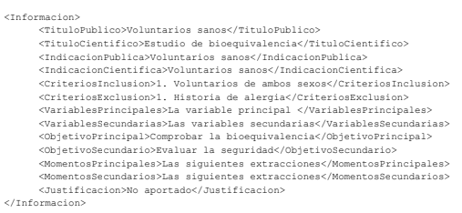

# REEC Crawler

## Introduction
REEC Crawler is project to download clinical trial data from [Registro Español de Estudios Clínicos (REEC)](https://reec.aemps.es/reec/public/web.html) and save them into *.json files and MongoDB. This is a pretty simple version, and it does not deal with duplicates in your MongoDB collection, so if you have and oldest version of the same record, the previous one will be maintained in the collection.

## Requeriments

1. Clone this repository:

```bash
git clone https://github.com/TeMU-BSC/REEC.git 
cd REEC
```

2. Create & activate virtual environment:

```bash
virtualenv .env
source .env/bin/activate
```

3. Install requirements:
```bash
pip install -r requirements.txt
```

After these steps, you should have everything up-to-date to start crawling data from REEC.

## Tutorial
If you are running this program for the first time and want to save the data in MongoDB, you will need to have MongoDB installed on your local or remote computer. It is not necessary to create a database or collection in Mongo beforehand, as you can predefine it in the function arguments.

### Arguments:
These are the arguments of the script:

|     Argument long name     |    Argument short name    |       Description              |
|:------------------:|:--------------------:|:-------------------:|
| `--from_date` | - |  **Required**. Date from which you want to start downloading data. Format: dd/MM/yyyy.|
| `--to_date` | - |      *Optional*. Date to which you want to download data. Format: dd/MM/yyyy.    |
|  `--out`  | `-o` |   **Required**. To define if you want to save the data only in a json file (`file`) or also in a collection (`mongo`). Default: `file`.   |
|  `--datapath`  | `-dpath` | **Required**. Absolute path where to save the generated json files. Default: `REEC/data` |
|  `--host`  | - | **Required if --out == `mongo`**. Define your Mongo host |
|  `--port`  | - | **Required if --out == `mongo`**. Define your Mongo port |
|  `--database`  | - |  **Required if --out == `mongo`**. Define the MongoDB database name  |
|  `--collection`  | -  |  **Required if --out == `mongo`**. Define the MongoDB collection name     |


### Some examples:

<details>
  <summary><b>Save results into json files from 01-01-2021. </b></summary>

```bash
python reec_script.py --from_date "01-01-2021" -o "file"
```
</details>
<details>
  <summary><b>Save results into localhost Mongo recird from 01-01-2021 to 15-01-2021. </b></summary>
      
```bash
python reec_script.py --from_date "01-01-2021" --to_date "15-01-2021" --out "mongo" --host "localhost" --port "27017" --database "new_database" --collection "test_collection"
```
</details>


## Structure of the records in MongoDB
Each REEC API call to get details about the information of a record has the following fields:


Having that into account, we have built the structure of MongoDB records as follows:
- **_id**: This is the clinical trial id number extracted from the REEC API.
- **ti_es**: The title corresponds to the field *tituloCientifico*.
- **ab_es**: The `abstract` is a string join between the fields:
      - [*tituloCientifico*, *indicadionPublica*, *indicacionCientifica*, *criteriosInclusion*, *criteriosExclusion*, *variablesPrincipales*, *variablesSecundarias*, *objetivoPrincipal*, *objetivoSecundario*, *momentosPrincipales*, *momentosSecundarios*, *justificacion*]

- **list_elem_not_found**: In case any of the record fields does not exist in the REEC database, a list containing the fields that do not exist in the record will appear here.
- **num_elem_not_found**: This is the number of the record fields that does not exist in the REEC database.
- **lang_ab**: Language of the abstract (in Spanish).
- **lang_ti**: Language of the title (in Spanish)


-----
More about the author:
> [luisgasco.es](http://luisgasco.es/) · GitHub:
> [@luisgasco](https://github.com/luisgasco) · Twitter:
> [@luisgasco](https://twitter.com/luisgasco)


